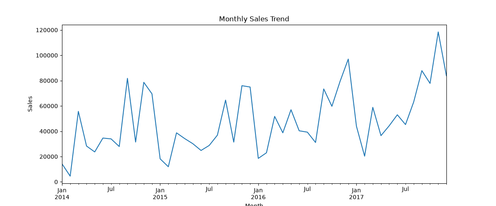
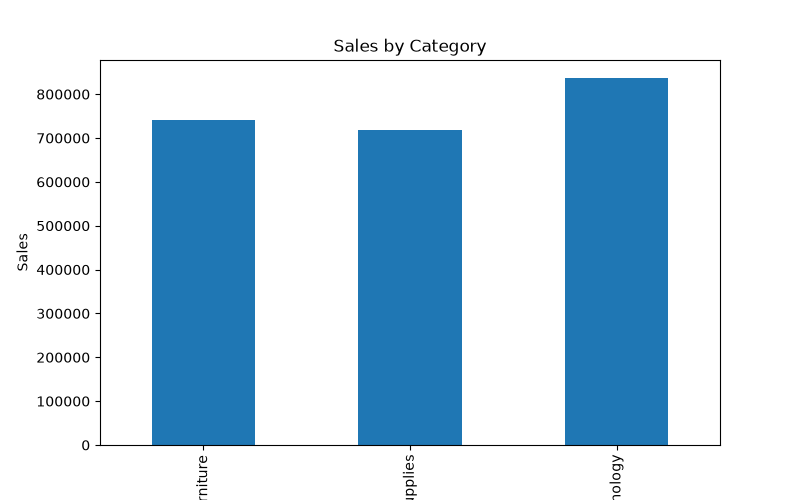
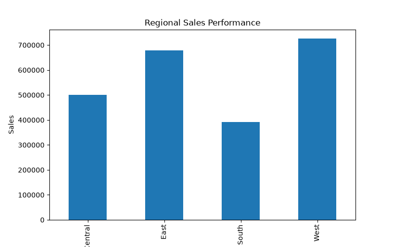

# Market Trend Analysis Using E-Commerce Data

## Overview

Market Trend Analysis Using E-Commerce Data is a data analytics project designed to identify sales patterns, category performance, and regional business trends using e-commerce transaction data.

The project applies data preprocessing, exploratory data analysis (EDA), trend analysis, and visualization techniques to generate actionable business insights that support strategic decision-making and revenue growth.

---

## Business Objective

Businesses generate large volumes of sales data that can be leveraged to understand customer behavior, market demand, and business performance.

This project aims to:

- Analyze sales trends over time
- Identify top-performing product categories
- Evaluate regional sales performance
- Discover seasonal sales patterns
- Generate business insights for decision-making

---

## Features

- Sales Trend Analysis
- Category Performance Analysis
- Regional Sales Analysis
- Exploratory Data Analysis (EDA)
- Business Intelligence Reporting
- Data Visualization
- Revenue Trend Identification
- Market Performance Evaluation

---

## Technologies Used

| Technology | Purpose |
|------------|----------|
| Python | Data Analysis |
| Pandas | Data Manipulation |
| NumPy | Numerical Computing |
| Matplotlib | Data Visualization |
| CSV Dataset | Data Source |

---

## Dataset

### Sample Superstore Dataset

The dataset contains:

- Customer Information
- Product Details
- Sales Transactions
- Regional Information
- Category Information
- Revenue Data
- Profit Metrics

### Dataset Statistics

| Metric | Value |
|----------|----------|
| Records | 9,994 |
| Categories | 3 |
| Regions | 4 |
| Features | 21 |

---

## Project Workflow

### 1. Data Collection

Collected e-commerce sales transaction records from the Sample Superstore Dataset.

### 2. Data Preprocessing

- Data loading
- Missing value verification
- Data cleaning
- Date conversion
- Dataset preparation

### 3. Trend Analysis

Performed:

- Monthly Sales Trend Analysis
- Category-Wise Performance Analysis
- Regional Sales Performance Analysis

### 4. Data Visualization

Generated visual reports to identify:

- Seasonal sales patterns
- Product category performance
- Regional business growth

### 5. Business Insight Generation

Derived actionable insights for business planning and decision-making.

---

## Results

### Monthly Sales Trend



The monthly sales trend analysis reveals fluctuations in revenue across different months and highlights seasonal business patterns.

---

### Category Sales Trend



Technology products generated the highest overall revenue, followed by Furniture and Office Supplies.

---

### Regional Sales Performance



The West region achieved the highest sales contribution, indicating strong market performance and customer demand.

---

## Key Business Insights

### Sales Trends

- Strong revenue growth observed during the final quarter of the year.
- November recorded the highest monthly sales performance.
- Seasonal demand patterns were identified.

### Category Insights

- Technology emerged as the highest-performing category.
- Furniture and Office Supplies contributed significantly to total sales.

### Regional Insights

- West region generated the highest revenue.
- East region demonstrated strong market performance.
- South region recorded comparatively lower sales.

### Strategic Insights

- Seasonal trends can support inventory planning.
- Regional insights can guide market expansion strategies.
- Category performance can assist product investment decisions.

---

## Analysis Summary

| Analysis | Status |
|-----------|----------|
| Data Preprocessing | Completed |
| Exploratory Data Analysis | Completed |
| Monthly Trend Analysis | Completed |
| Category Analysis | Completed |
| Regional Analysis | Completed |
| Visualization | Completed |
| Business Insights | Completed |

---

## Project Structure

```text
Market-Trend-Analysis-Using-E-Commerce-Data/
│
├── data/
│   ├── Sample - Superstore.csv
│   └── cleaned_market_data.csv
│
├── src/
│   ├── data_preprocessing.py
│   ├── trend_analysis.py
│   └── visualization.py
│
├── results/
│   ├── monthly_sales_trend.png
│   ├── category_sales_trend.png
│   └── regional_sales_trend.png
│
├── notebooks/
│
├── README.md
├── requirements.txt
└── .gitignore
```

---

## Applications

- Market Research
- Business Intelligence
- Sales Analytics
- Revenue Analysis
- Trend Forecasting
- Strategic Planning
- Data-Driven Decision Making

---

## Future Enhancements

- Interactive Power BI Dashboard
- Real-Time Sales Monitoring
- Customer Segmentation Analysis
- Predictive Sales Forecasting
- Advanced Business Intelligence Reporting

---

## Author

**Panjala Shambhavi**

B.Tech Artificial Intelligence & Machine Learning (AIML)

---

## License

This project is intended for educational, learning, and portfolio purposes.
